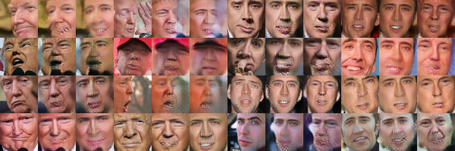

sum: accumulate training time

### 23/07/2018 ~1600

use_cyclic_loss = False
lr_factor = 1.0
m_mask = 0.0
use_mask_hinge_loss = False
use_PL = False

gan_training = mixup_LSGAN

----------
[iter 6000] Loss_DA: 0.288900 Loss_DB: 0.233370 Loss_GA: 0.867716 Loss_GB: 0.962821 time: 1743.735267

----------
Generator loss details:
[Adversarial loss]
GA: 0.0925 GB: 0.0976
[Reconstruction loss]
GA: 0.3905 GB: 0.4035
[Edge loss]
GA: 0.2804 GB: 0.3697

----------
Transformed (masked) results:

Masks:

Reconstruction results:

Model weights files have been saved to ./models.

----------------------------------------------------------------------------------------------------

use_cyclic_loss = False
lr_factor = 1.0
m_mask = 0.0
use_mask_hinge_loss = False
use_PL = True
gan_training = mixup_LSGAN

----------
[iter 8400] Loss_DA: 0.178859 Loss_DB: 0.156237 Loss_GA: 1.143151 Loss_GB: 1.229797 time: 2645.130341

----------
Generator loss details:
[Adversarial loss]
GA: 0.1095 GB: 0.1239
[Reconstruction loss]
GA: 0.3702 GB: 0.3769
[Edge loss]
GA: 0.2827 GB: 0.3711
[Perceptual loss]

----------------------------------------------------------------------------------------------------

### 23/07/2018 ~1650

[iter ~6000]

----------------------------------------------------------------------------------------------------

### 24/07/2018 ~0900

use_PL = False
lr_factor = 1.0
gan_training = mixup_LSGAN
use_mask_hinge_loss = False
m_mask = 0.0
use_cyclic_loss = False

----------
[iter 1500] Loss_DA: 0.135482 Loss_DB: 0.156517 Loss_GA: 0.800406 Loss_GB: 0.906570 time: 481.679060

----------
Generator loss details:
[Adversarial loss]
GA: 0.1206 GB: 0.1154
[Reconstruction loss]
GA: 0.3358 GB: 0.3513
[Edge loss]
GA: 0.2710 GB: 0.3639

----------
Transformed (masked) results:

Masks:

Reconstruction results:

Model weights files have been saved to ./models.

----------------------------------------------------------------------------------------------------

use_PL = True
lr_factor = 1.0
gan_training = mixup_LSGAN
use_mask_hinge_loss = False
m_mask = 0.0
use_cyclic_loss = False

----------
[iter 10500] Loss_DA: 0.101948 Loss_DB: 0.115608 Loss_GA: 1.022073 Loss_GB: 1.111110 time: 3629.976019

----------
Generator loss details:
[Adversarial loss]
GA: 0.1285 GB: 0.1275
[Reconstruction loss]
GA: 0.3060 GB: 0.3222
[Edge loss]
GA: 0.2641 GB: 0.3549
[Perceptual loss]
GA: 0.2532 GB: 0.2307

----------
Transformed (masked) results:

Masks:

Reconstruction results:

Model weights files have been saved to ./models.

----------------------------------------------------------------------------------------------------

use_PL = True
lr_factor = 1.0
gan_training = mixup_LSGAN
use_mask_hinge_loss = True
m_mask = 0.4
use_cyclic_loss = False

----------
[iter 21300] Loss_DA: 0.095005 Loss_DB: 0.111514 Loss_GA: 0.979905 Loss_GB: 1.055235 time: 8772.047746

----------
Generator loss details:
[Adversarial loss]
GA: 0.1288 GB: 0.1208
[Reconstruction loss]
GA: 0.2864 GB: 0.3037
[Edge loss]
GA: 0.2579 GB: 0.3464
[Perceptual loss]
GA: 0.2346 GB: 0.2077

----------
Transformed (masked) results:

Masks:

Reconstruction results:

Model weights files have been saved to ./models.

----------------------------------------------------------------------------------------------------

### 24/07/2018 1123
### GPU:1

m_mask = 0.0
use_PL = True
use_mask_hinge_loss = False
gan_training = mixup_LSGAN
lr_factor = 0.1
use_cyclic_loss = False

----------
[iter 39600] Loss_DA: 0.055350 Loss_DB: 0.073665 Loss_GA: 0.884378 Loss_GB: 0.969135 time: 16338.711218

----------
Generator loss details:
[Adversarial loss]
GA: 0.1344 GB: 0.1264
[Reconstruction loss]
GA: 0.2327 GB: 0.2570
[Edge loss]
GA: 0.2345 GB: 0.3270
[Perceptual loss]
GA: 0.2081 GB: 0.1849

----------
Transformed (masked) results:

Masks:

Reconstruction results:

Model weights files have been saved to ./models.